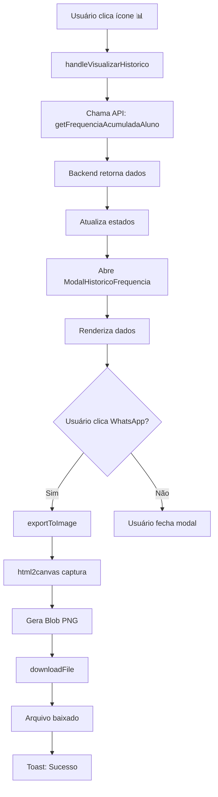

# 📋 PLANO DE IMPLEMENTAÇÃO - Histórico de Frequências no Dashboard

**Data:** 07/03/2026  
**Autor:** GitHub Copilot (Senior Fullstack Developer)  
**Status:** Aguardando Autorização do Cliente

---

## 🎯 OBJETIVO

Adicionar funcionalidade de visualização de histórico de frequências individuais dos alunos diretamente no Dashboard, com capacidade de exportação para compartilhamento via WhatsApp com os pais.

---

## 📊 ANÁLISE DA SITUAÇÃO ATUAL

### ✅ O que já existe e funciona:
1. **Backend:** Endpoint funcional `/api/frequencias/aluno/:alunoId/acumulado`
2. **Frontend Frequencias.js:** Modal completo com:
   - Visualização de histórico individual
   - Resumo geral (total, presenças, faltas, percentual)
   - Breakdown por disciplina
   - Histórico diário
   - Handler `handleVisualizarFrequenciaAluno()` testado e funcional
3. **Service:** `frequenciaService.getFrequenciaAcumuladaAluno()` operacional
4. **Dashboard.js:** Tabela de alunos com dados de frequência acumulada (linhas 3150-3260)

### 🔍 O que precisa ser implementado:
1. **Ícone de Histórico:** Adicionar coluna ou ícone na tabela de alunos do Dashboard
2. **Reutilização de Lógica:** Adaptar o handler de Frequencias.js para o Dashboard
3. **Modal no Dashboard:** Criar modal similar ou componentizar o existente
4. **Exportação:** Funcionalidade de captura de tela/PDF do modal
5. **Botão WhatsApp:** Interface intuitiva para compartilhar com pais

---

## 🏗️ ARQUITETURA DA SOLUÇÃO

### **Abordagem: Componentização + Reutilização (Boas Práticas)**

```
client/src/
├── components/
│   ├── ModalHistoricoFrequencia.js  [NOVO] ← Componente reutilizável
│   └── ExportButton.js              [NOVO] ← Botão de exportação
├── pages/
│   ├── Dashboard.js                 [MODIFICAR] ← Adicionar ícone + lógica
│   └── Frequencias.js               [REFATORAR] ← Usar novo componente
└── utils/
    └── exportUtils.js               [NOVO] ← Funções de exportação
```

---

## 📝 DETALHAMENTO DAS MUDANÇAS

### **1. CRIAR COMPONENTE REUTILIZÁVEL: `ModalHistoricoFrequencia.js`**

**Localização:** `client/src/components/ModalHistoricoFrequencia.js`

**Responsabilidades:**
- Receber dados de frequência via props
- Renderizar modal com:
  - Cabeçalho com nome e matrícula do aluno
  - Resumo geral (total, presenças, faltas, percentual)
  - Tabela por disciplina
  - Histórico diário
  - Botão de exportação no canto superior direito

**Props:**
```javascript
{
  open: boolean,
  onClose: function,
  aluno: object,              // { _id, nome, matricula }
  frequenciaData: object,     // Dados retornados pela API
  onExport: function          // Handler de exportação
}
```

**Vantagens:**
- ✅ Reutilizável em Dashboard e Frequencias
- ✅ Facilita manutenção
- ✅ Código limpo e organizado
- ✅ Possibilita testes unitários

---

### **2. CRIAR UTILITÁRIO DE EXPORTAÇÃO: `exportUtils.js`**

**Localização:** `client/src/utils/exportUtils.js`

**Funções:**
```javascript
// Captura elemento DOM como imagem PNG
export const exportToImage = async (elementId, fileName) => {
  // Usa html2canvas para capturar
  // Retorna Blob da imagem
}

// Gera PDF otimizado para compartilhamento
export const exportToPDF = async (elementId, fileName) => {
  // Usa html2pdf.js
  // Retorna Blob do PDF
}

// Dispara download do arquivo
export const downloadFile = (blob, fileName) => {
  // Cria link temporário e dispara download
}

// Prepara mensagem WhatsApp (opcional)
export const prepareWhatsAppMessage = (alunoNome, percentual) => {
  // Retorna texto formatado para WhatsApp
}
```

**Dependências:**
- ✅ `html2canvas` (já instalado)
- ✅ `html2pdf.js` (já instalado)

---

### **3. MODIFICAR `Dashboard.js`**

**Localização:** `client/src/pages/Dashboard.js` (linhas ~3150-3260)

#### **3.1. Adicionar Estados**
```javascript
const [openModalHistorico, setOpenModalHistorico] = useState(false);
const [alunoHistoricoSelecionado, setAlunoHistoricoSelecionado] = useState(null);
const [frequenciaHistorico, setFrequenciaHistorico] = useState(null);
```

#### **3.2. Adicionar Handler**
```javascript
const handleVisualizarHistorico = async (aluno) => {
  try {
    setLoading(true);
    setAlunoHistoricoSelecionado(aluno);
    
    const params = {
      turma: filters.turma
    };
    
    if (filters.dataInicio && filters.dataFim) {
      params.dataInicio = filters.dataInicio;
      params.dataFim = filters.dataFim;
    }
    
    const data = await frequenciaService.getFrequenciaAcumuladaAluno(
      aluno.aluno._id, 
      params
    );
    
    setFrequenciaHistorico(data);
    setOpenModalHistorico(true);
    
  } catch (error) {
    toast.error('Erro ao carregar histórico: ' + error.message);
  } finally {
    setLoading(false);
  }
};
```

#### **3.3. Modificar Tabela - Adicionar Coluna de Ação**

**ANTES (linha ~3151):**
```javascript
<TableHead>
  <TableRow>
    <TableCell>Aluno</TableCell>
    <TableCell align="center">Total Aulas</TableCell>
    <TableCell align="center">Presentes</TableCell>
    <TableCell align="center">Faltas</TableCell>
    <TableCell align="center">Frequência</TableCell>
    <TableCell align="center">Status</TableCell>
  </TableRow>
</TableHead>
```

**DEPOIS:**
```javascript
<TableHead>
  <TableRow>
    <TableCell>Ações</TableCell>  {/* NOVA COLUNA */}
    <TableCell>Aluno</TableCell>
    <TableCell align="center">Total Aulas</TableCell>
    <TableCell align="center">Presentes</TableCell>
    <TableCell align="center">Faltas</TableCell>
    <TableCell align="center">Frequência</TableCell>
    <TableCell align="center">Status</TableCell>
  </TableRow>
</TableHead>
```

#### **3.4. Adicionar Ícone na Linha do Aluno**

**ANTES (linha ~3180):**
```javascript
<TableRow key={aluno.aluno._id}>
  <TableCell>
    <Typography variant="body2" fontWeight="600">
      {aluno.aluno.nome}
    </Typography>
    {/* ... resto do conteúdo ... */}
  </TableCell>
  {/* ... outras células ... */}
</TableRow>
```

**DEPOIS:**
```javascript
<TableRow key={aluno.aluno._id}>
  <TableCell align="center">  {/* NOVA CÉLULA */}
    <Tooltip title="Ver Histórico de Frequências">
      <IconButton
        onClick={() => handleVisualizarHistorico(aluno)}
        color="primary"
        size="small"
      >
        <Assessment />
      </IconButton>
    </Tooltip>
  </TableCell>
  <TableCell>
    <Typography variant="body2" fontWeight="600">
      {aluno.aluno.nome}
    </Typography>
    {/* ... resto do conteúdo ... */}
  </TableCell>
  {/* ... outras células ... */}
</TableRow>
```

#### **3.5. Adicionar Modal no Render**

**No final da função de render, antes do último `</>` (linha ~3400):**
```javascript
{/* Modal de Histórico de Frequência */}
<ModalHistoricoFrequencia
  open={openModalHistorico}
  onClose={() => {
    setOpenModalHistorico(false);
    setAlunoHistoricoSelecionado(null);
    setFrequenciaHistorico(null);
  }}
  aluno={alunoHistoricoSelecionado}
  frequenciaData={frequenciaHistorico}
/>
```

#### **3.6. Adicionar Imports**
```javascript
import { Assessment } from '@mui/icons-material'; // Ícone de histórico
import ModalHistoricoFrequencia from '../components/ModalHistoricoFrequencia';
import frequenciaService from '../services/frequenciaService';
```

---

### **4. CRIAR `ModalHistoricoFrequencia.js`**

**Estrutura do Componente:**

```javascript
import React, { useRef } from 'react';
import {
  Dialog,
  DialogTitle,
  DialogContent,
  DialogActions,
  Button,
  Box,
  Typography,
  Paper,
  Grid,
  Table,
  TableBody,
  TableCell,
  TableContainer,
  TableHead,
  TableRow,
  Chip,
  IconButton,
  Tooltip
} from '@mui/material';
import {
  Assessment,
  Close,
  Download,
  WhatsApp
} from '@mui/icons-material';
import { exportToImage, downloadFile } from '../utils/exportUtils';
import { toast } from 'react-toastify';

const ModalHistoricoFrequencia = ({ 
  open, 
  onClose, 
  aluno, 
  frequenciaData 
}) => {
  const contentRef = useRef(null);
  
  const handleExport = async () => {
    try {
      const blob = await exportToImage('modal-content', `historico-${aluno.nome}.png`);
      downloadFile(blob, `historico-${aluno.nome}.png`);
      
      toast.success('✅ Imagem exportada! Pronta para enviar via WhatsApp');
      
      // Opcional: Sugerir mensagem WhatsApp
      const mensagem = `📊 *Histórico de Frequência*\n` +
                      `Aluno: ${aluno.nome}\n` +
                      `Frequência: ${frequenciaData?.resumoGeral?.percentualPresenca}%`;
      
      console.log('💬 Sugestão de mensagem WhatsApp:', mensagem);
      
    } catch (error) {
      toast.error('Erro ao exportar imagem');
      console.error(error);
    }
  };
  
  const formatarDataLocal = (data) => {
    // Implementação de formatação
  };
  
  if (!frequenciaData || !aluno) return null;
  
  return (
    <Dialog open={open} onClose={onClose} maxWidth="md" fullWidth>
      <DialogTitle>
        <Box sx={{ display: 'flex', alignItems: 'center', justifyContent: 'space-between' }}>
          <Box sx={{ display: 'flex', alignItems: 'center', gap: 1 }}>
            <Assessment color="primary" />
            <Box>
              <Typography variant="h6">Histórico de Frequência</Typography>
              <Typography variant="subtitle2" color="text.secondary">
                {aluno.nome} - Mat: {aluno.matricula}
              </Typography>
            </Box>
          </Box>
          <Box sx={{ display: 'flex', gap: 1 }}>
            <Tooltip title="Exportar para WhatsApp">
              <IconButton 
                onClick={handleExport} 
                color="success"
                sx={{
                  bgcolor: '#25D366',
                  color: 'white',
                  '&:hover': { bgcolor: '#128C7E' }
                }}
              >
                <WhatsApp />
              </IconButton>
            </Tooltip>
            <IconButton onClick={onClose}>
              <Close />
            </IconButton>
          </Box>
        </Box>
      </DialogTitle>
      <DialogContent>
        <Box id="modal-content" ref={contentRef}>
          {/* RESUMO GERAL */}
          <Paper sx={{ p: 2, mb: 3, bgcolor: 'background.default' }}>
            <Typography variant="subtitle2" gutterBottom>
              📊 Resumo Geral {frequenciaData.periodo?.descricao || ''}
            </Typography>
            <Grid container spacing={2} sx={{ mt: 1 }}>
              <Grid item xs={3}>
                <Box sx={{ textAlign: 'center' }}>
                  <Typography variant="h4" color="primary.main">
                    {frequenciaData.resumoGeral.total}
                  </Typography>
                  <Typography variant="caption" color="text.secondary">
                    Total
                  </Typography>
                </Box>
              </Grid>
              <Grid item xs={3}>
                <Box sx={{ textAlign: 'center' }}>
                  <Typography variant="h4" color="success.main">
                    {frequenciaData.resumoGeral.presentes}
                  </Typography>
                  <Typography variant="caption" color="text.secondary">
                    Presenças
                  </Typography>
                </Box>
              </Grid>
              <Grid item xs={3}>
                <Box sx={{ textAlign: 'center' }}>
                  <Typography variant="h4" color="error.main">
                    {frequenciaData.resumoGeral.faltas}
                  </Typography>
                  <Typography variant="caption" color="text.secondary">
                    Faltas
                  </Typography>
                </Box>
              </Grid>
              <Grid item xs={3}>
                <Box sx={{ textAlign: 'center' }}>
                  <Typography variant="h4" color="warning.main">
                    {frequenciaData.resumoGeral.justificadas}
                  </Typography>
                  <Typography variant="caption" color="text.secondary">
                    Justificadas
                  </Typography>
                </Box>
              </Grid>
            </Grid>
            <Box sx={{ mt: 2, textAlign: 'center' }}>
              <Typography variant="h5" 
                sx={{ 
                  color: frequenciaData.resumoGeral.percentualPresenca >= 75 ? 'success.main' : 'error.main'
                }}
              >
                {frequenciaData.resumoGeral.percentualPresenca}% de Presença
              </Typography>
            </Box>
          </Paper>

          {/* POR DISCIPLINA */}
          {frequenciaData.porDisciplina?.length > 0 && (
            <Box sx={{ mb: 3 }}>
              <Typography variant="subtitle2" gutterBottom>
                📚 Por Disciplina
              </Typography>
              <TableContainer component={Paper}>
                <Table size="small">
                  <TableHead>
                    <TableRow>
                      <TableCell>Disciplina</TableCell>
                      <TableCell align="center">Total</TableCell>
                      <TableCell align="center">Presentes</TableCell>
                      <TableCell align="center">Faltas</TableCell>
                      <TableCell align="center">%</TableCell>
                    </TableRow>
                  </TableHead>
                  <TableBody>
                    {frequenciaData.porDisciplina.map((disc, idx) => (
                      <TableRow key={idx}>
                        <TableCell>{disc.disciplina.nome}</TableCell>
                        <TableCell align="center">{disc.total}</TableCell>
                        <TableCell align="center">
                          <Chip label={disc.presentes} color="success" size="small" />
                        </TableCell>
                        <TableCell align="center">
                          <Chip label={disc.faltas + disc.justificadas} color="error" size="small" />
                        </TableCell>
                        <TableCell align="center">
                          <Typography
                            sx={{
                              color: disc.percentualPresenca >= 75 ? 'success.main' : 'error.main',
                              fontWeight: 600
                            }}
                          >
                            {disc.percentualPresenca}%
                          </Typography>
                        </TableCell>
                      </TableRow>
                    ))}
                  </TableBody>
                </Table>
              </TableContainer>
            </Box>
          )}

          {/* HISTÓRICO DIÁRIO */}
          {frequenciaData.historicoDiario?.length > 0 && (
            <Box>
              <Typography variant="subtitle2" gutterBottom>
                📅 Histórico Diário
              </Typography>
              <TableContainer component={Paper} sx={{ maxHeight: 200 }}>
                <Table size="small" stickyHeader>
                  <TableHead>
                    <TableRow>
                      <TableCell>Data</TableCell>
                      <TableCell align="center">Presentes</TableCell>
                      <TableCell align="center">Faltas</TableCell>
                      <TableCell align="center">%</TableCell>
                    </TableRow>
                  </TableHead>
                  <TableBody>
                    {frequenciaData.historicoDiario.map((dia, idx) => (
                      <TableRow key={idx}>
                        <TableCell>{formatarDataLocal(dia._id)}</TableCell>
                        <TableCell align="center">
                          <Chip label={dia.presentes} color="success" size="small" />
                        </TableCell>
                        <TableCell align="center">
                          <Chip label={dia.faltas + dia.justificadas} color="error" size="small" />
                        </TableCell>
                        <TableCell align="center">
                          <Typography variant="body2">
                            {dia.percentualPresenca}%
                          </Typography>
                        </TableCell>
                      </TableRow>
                    ))}
                  </TableBody>
                </Table>
              </TableContainer>
            </Box>
          )}
        </Box>
      </DialogContent>
      <DialogActions>
        <Button onClick={onClose}>Fechar</Button>
      </DialogActions>
    </Dialog>
  );
};

export default ModalHistoricoFrequencia;
```

---

### **5. CRIAR `exportUtils.js`**

**Implementação Completa:**

```javascript
import html2canvas from 'html2canvas';
import html2pdf from 'html2pdf.js';

/**
 * Exporta um elemento DOM como imagem PNG
 * @param {string} elementId - ID do elemento a ser capturado
 * @param {string} fileName - Nome do arquivo de saída
 * @returns {Promise<Blob>} - Blob da imagem gerada
 */
export const exportToImage = async (elementId, fileName = 'export.png') => {
  const element = document.getElementById(elementId);
  
  if (!element) {
    throw new Error(`Elemento com ID "${elementId}" não encontrado`);
  }
  
  const canvas = await html2canvas(element, {
    scale: 2, // Alta qualidade
    useCORS: true,
    logging: false,
    backgroundColor: '#ffffff'
  });
  
  return new Promise((resolve, reject) => {
    canvas.toBlob((blob) => {
      if (blob) {
        resolve(blob);
      } else {
        reject(new Error('Falha ao gerar imagem'));
      }
    }, 'image/png');
  });
};

/**
 * Exporta um elemento DOM como PDF
 * @param {string} elementId - ID do elemento a ser capturado
 * @param {string} fileName - Nome do arquivo de saída
 * @returns {Promise<Blob>} - Blob do PDF gerado
 */
export const exportToPDF = async (elementId, fileName = 'export.pdf') => {
  const element = document.getElementById(elementId);
  
  if (!element) {
    throw new Error(`Elemento com ID "${elementId}" não encontrado`);
  }
  
  const options = {
    margin: 10,
    filename: fileName,
    image: { type: 'jpeg', quality: 0.98 },
    html2canvas: { scale: 2, useCORS: true },
    jsPDF: { unit: 'mm', format: 'a4', orientation: 'portrait' }
  };
  
  return html2pdf().from(element).set(options).output('blob');
};

/**
 * Download de arquivo (blob)
 * @param {Blob} blob - Blob do arquivo
 * @param {string} fileName - Nome do arquivo
 */
export const downloadFile = (blob, fileName) => {
  const url = window.URL.createObjectURL(blob);
  const link = document.createElement('a');
  link.href = url;
  link.download = fileName;
  document.body.appendChild(link);
  link.click();
  document.body.removeChild(link);
  window.URL.revokeObjectURL(url);
};

/**
 * Prepara mensagem formatada para WhatsApp
 * @param {string} alunoNome - Nome do aluno
 * @param {number} percentual - Percentual de frequência
 * @param {object} resumo - Resumo de dados
 * @returns {string} - Mensagem formatada
 */
export const prepareWhatsAppMessage = (alunoNome, percentual, resumo) => {
  return `📊 *Histórico de Frequência - SISTGESEDU*\n\n` +
         `👤 Aluno: ${alunoNome}\n` +
         `📈 Frequência: ${percentual}%\n` +
         `✅ Presenças: ${resumo.presentes}\n` +
         `❌ Faltas: ${resumo.faltas}\n` +
         `⚠️ Justificadas: ${resumo.justificadas}\n` +
         `📚 Total de Registros: ${resumo.total}\n\n` +
         `_Imagem com detalhes em anexo_`;
};
```

---

### **6. REFATORAR `Frequencias.js` (OPCIONAL)**

**Substituir modal atual pelo componente reutilizável:**

**ANTES:**
```javascript
{/* Modal de Frequência Individual do Aluno - código inline */}
<Dialog open={openModalFrequenciaIndividual}>
  {/* ... 200+ linhas de código ... */}
</Dialog>
```

**DEPOIS:**
```javascript
<ModalHistoricoFrequencia
  open={openModalFrequenciaIndividual}
  onClose={() => {
    setOpenModalFrequenciaIndividual(false);
    setAlunoSelecionado(null);
    setFrequenciaAcumuladaAluno(null);
  }}
  aluno={alunoSelecionado}
  frequenciaData={frequenciaAcumuladaAluno}
/>
```

**Vantagem:** Reduz código duplicado e facilita manutenção.

---

## 🎨 INTERFACE DO USUÁRIO

### **Dashboard - Tabela de Alunos (Mockup)**

```
╔═══════════════════════════════════════════════════════════════════════════╗
║  AÇÕES  │  ALUNO              │  TOTAL  │ PRESENTES │ FALTAS │ FREQ. │ ...║
╠═══════════════════════════════════════════════════════════════════════════╣
║   📊    │  João Silva         │   20    │    18     │   2    │ 90%   │ ...║
║         │  Mat: 5719243       │         │           │        │       │    ║
╠─────────┼─────────────────────┼─────────┼───────────┼────────┼───────┼────╣
║   📊    │  Maria Santos       │   20    │    20     │   0    │ 100%  │ ...║
║         │  Mat: 5978338       │         │           │        │       │    ║
╚═══════════════════════════════════════════════════════════════════════════╝
              ↑
         [ÍCONE CLICÁVEL]
```

### **Modal de Histórico (Mockup)**

```
╔═══════════════════════════════════════════════════════════════╗
║  📊 Histórico de Frequência              [WhatsApp] [X]       ║
║  João Silva - Mat: 5719243                                    ║
╠═══════════════════════════════════════════════════════════════╣
║                                                               ║
║  📊 Resumo Geral                                              ║
║  ┌─────────┬──────────┬─────────┬─────────────┐              ║
║  │   20    │    18    │    2    │      0      │              ║
║  │  Total  │ Presenças│  Faltas │ Justificadas│              ║
║  └─────────┴──────────┴─────────┴─────────────┘              ║
║                  90% de Presença                              ║
║                                                               ║
║  📚 Por Disciplina                                            ║
║  ┌──────────────┬───────┬──────┬────────┬─────┐             ║
║  │ Disciplina   │ Total │ Pres │ Faltas │  %  │             ║
║  ├──────────────┼───────┼──────┼────────┼─────┤             ║
║  │ Matemática   │   5   │  5   │   0    │100% │             ║
║  │ Português    │   5   │  4   │   1    │ 80% │             ║
║  └──────────────┴───────┴──────┴────────┴─────┘             ║
║                                                               ║
║  📅 Histórico Diário                                          ║
║  ┌────────────┬──────┬────────┬─────┐                       ║
║  │    Data    │ Pres │ Faltas │  %  │                       ║
║  ├────────────┼──────┼────────┼─────┤                       ║
║  │ 05/03/2026 │  4   │   0    │100% │                       ║
║  │ 06/03/2026 │  3   │   1    │ 75% │                       ║
║  └────────────┴──────┴────────┴─────┘                       ║
║                                                               ║
╠═══════════════════════════════════════════════════════════════╣
║                                           [Fechar]            ║
╚═══════════════════════════════════════════════════════════════╝
```

### **Botão WhatsApp - Comportamento**

1. **Ao clicar no ícone WhatsApp (verde):**
   - Captura screenshot do conteúdo do modal
   - Gera arquivo PNG de alta qualidade
   - Baixa automaticamente para o computador
   - Exibe mensagem de sucesso: "✅ Imagem exportada! Pronta para enviar via WhatsApp"

2. **Usuário então pode:**
   - Abrir WhatsApp Web ou App
   - Anexar a imagem baixada
   - Enviar para o responsável do aluno

---

## ⚙️ IMPLEMENTAÇÃO TÉCNICA

### **Fluxo de Dados**



### **Segurança de Dados**

✅ **NENHUM DADO SERÁ MODIFICADO OU EXCLUÍDO**

- ✅ Apenas chamadas **GET** (leitura)
- ✅ Nenhuma mutação de estado do banco
- ✅ Backend já validado e funcional
- ✅ Exportação ocorre apenas no frontend (cliente)
- ✅ Nenhum envio automático (usuário tem controle total)

### **Performance**

- ✅ Lazy loading do html2canvas (já instalado)
- ✅ Captura assíncrona (não trava UI)
- ✅ Componente modal otimizado
- ✅ Reutilização de código reduz bundle size

---

## 📦 DEPENDÊNCIAS

### **Já Instaladas:**
- ✅ `html2canvas` (v1.4.1)
- ✅ `html2pdf.js` (v0.14.0)
- ✅ `@mui/material` (v6.5.0)
- ✅ `@mui/icons-material` (v6.5.0)
- ✅ `react-toastify` (v10.0.x)

### **Novas:**
- ❌ Nenhuma! Tudo já está disponível.

---

## 🧪 TESTES RECOMENDADOS

### **Checklist de QA:**

1. **Funcionalidade Básica:**
   - [ ] Ícone aparece na primeira coluna da tabela
   - [ ] Tooltip exibe "Ver Histórico de Frequências"
   - [ ] Click no ícone abre modal
   - [ ] Dados corretos são exibidos no modal
   - [ ] Modal fecha corretamente

2. **Exportação:**
   - [ ] Botão WhatsApp visível no modal
   - [ ] Click gera imagem PNG
   - [ ] Imagem tem boa qualidade (legível)
   - [ ] Download automático funciona
   - [ ] Nome do arquivo é intuitivo (historico-NomeAluno.png)

3. **Responsividade:**
   - [ ] Modal adapta em telas menores
   - [ ] Imagem exportada mantém proporções
   - [ ] Tabelas com scroll horizontal se necessário

4. **Edge Cases:**
   - [ ] Aluno sem frequências registradas
   - [ ] Aluno com muitas disciplinas (scroll vertical)
   - [ ] Filtros de data aplicados corretamente
   - [ ] Loading states visíveis

5. **Integração:**
   - [ ] Não afeta outras funcionalidades do Dashboard
   - [ ] Não afeta página de Frequencias
   - [ ] Console sem erros
   - [ ] Performance adequada (< 2s para abrir modal)

---

## 📊 ESTIMATIVA DE ESFORÇO

### **Complexidade: BAIXA-MÉDIA**

| Tarefa                         | Tempo Estimado | Complexidade |
|--------------------------------|----------------|--------------|
| Criar `exportUtils.js`         | 30 min         | Baixa        |
| Criar `ModalHistoricoFrequencia.js` | 1h 30min  | Média        |
| Modificar `Dashboard.js`       | 1h             | Baixa        |
| Testes e ajustes               | 1h             | Baixa        |
| **TOTAL**                      | **4 horas**    | -            |

---

## 🚀 ORDEM DE IMPLEMENTAÇÃO

1. ✅ Criar `exportUtils.js` (utilitários prontos)
2. ✅ Criar `ModalHistoricoFrequencia.js` (componente isolado)
3. ✅ Testar componente standalone
4. ✅ Modificar `Dashboard.js` (adicionar ícone + handler + modal)
5. ✅ Testar integração completa
6. ✅ Refatorar `Frequencias.js` (opcional, para consistência)
7. ✅ Testes finais de QA

---

## ✅ CHECKLIST DE APROVAÇÃO

### **Antes de Implementar:**

- [ ] Cliente revisou o plano completo
- [ ] Cliente aprova a localização do ícone (primeira coluna)
- [ ] Cliente aprova o formato de exportação (PNG)
- [ ] Cliente confirma que apenas imagem é suficiente (sem envio automático)
- [ ] Cliente autoriza início da implementação

### **Questões para o Cliente:**

1. **Posicionamento do Ícone:**
   - ✅ Primeira coluna (antes do nome) ← **RECOMENDADO**
   - ⚪ Última coluna (depois do status)
   - ⚪ Junto com o nome do aluno (inline)

2. **Formato de Exportação:**
   - ✅ PNG (imagem) ← **RECOMENDADO para WhatsApp**
   - ⚪ PDF (documento)
   - ⚪ Ambos (opção no modal)

3. **Título do Modal:**
   - ✅ "Histórico de Frequência" ← **ATUAL**
   - ⚪ "Relatório de Frequências"
   - ⚪ Outro: __________

4. **Refatorar Frequencias.js?**
   - ✅ Sim (reduz código duplicado) ← **RECOMENDADO**
   - ⚪ Não (manter como está)

---

## 📝 OBSERVAÇÕES FINAIS

### **Vantagens desta Abordagem:**

- ✅ **Reutilização Total:** Backend já funciona, apenas adiciona frontend
- ✅ **Zero Risco:** Nenhuma alteração em dados existentes
- ✅ **Componentização:** Código limpo e manutenível
- ✅ **UX Consistente:** Mesmo padrão visual usado em Frequencias
- ✅ **Escalável:** Fácil adicionar novas funcionalidades (ex: envio por email)
- ✅ **Mobile-Friendly:** Exportação funciona em qualquer dispositivo

### **Melhorias Futuras (Não incluídas neste plano):**

- 📧 Envio automático por email
- 📱 Compartilhamento direto via Web Share API
- 📊 Filtros adicionais no modal (por disciplina, período)
- 🏆 Badges de reconhecimento (Melhor frequência do mês, etc.)
- 📈 Gráficos de evolução temporal

---

## 🎯 PRÓXIMOS PASSOS

1. **Cliente revisa este documento**
2. **Cliente aprova (responde às 4 questões acima)**
3. **Desenvolvedor inicia implementação seguindo o plano**
4. **Testes incrementais a cada etapa**
5. **Entrega final com QA completo**

---

**Status:** 🟡 **AGUARDANDO APROVAÇÃO DO CLIENTE**

**Data de Criação:** 07/03/2026  
**Autor:** GitHub Copilot (Senior Fullstack Developer)  
**Documentação:** PLANO_HISTORICO_FREQUENCIA_DASHBOARD.md

---

## 🤝 AUTORIZAÇÃO

**Cliente:** _______________________________  
**Data:** ___/___/______  
**Assinatura:** _______________________________

**Observações/Modificações Solicitadas:**
```
_________________________________________________________________
_________________________________________________________________
_________________________________________________________________
```

---

